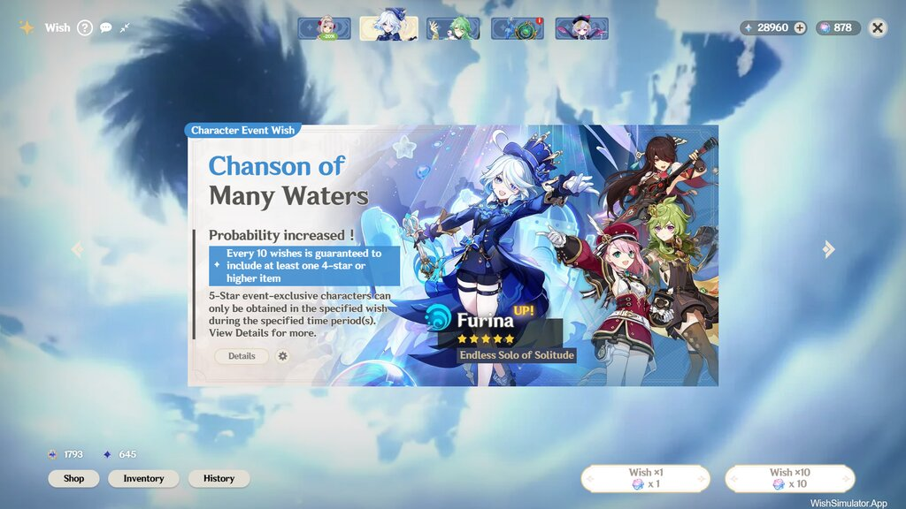
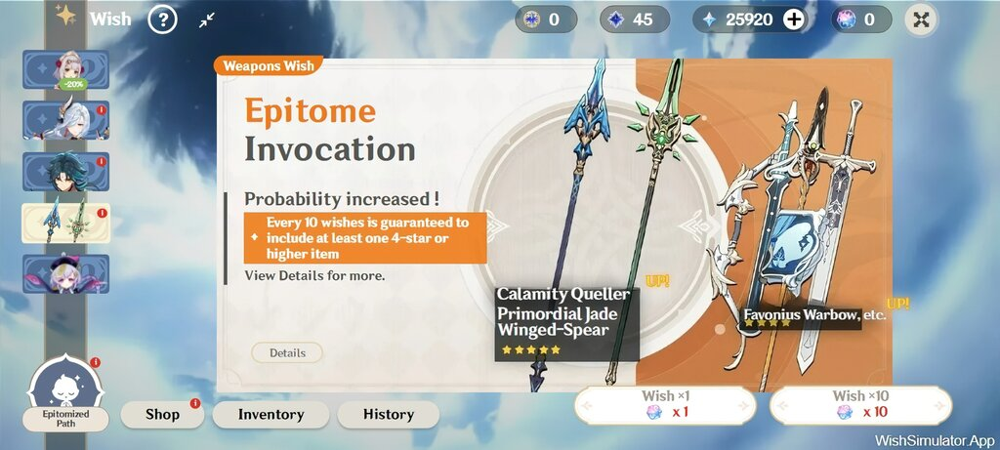
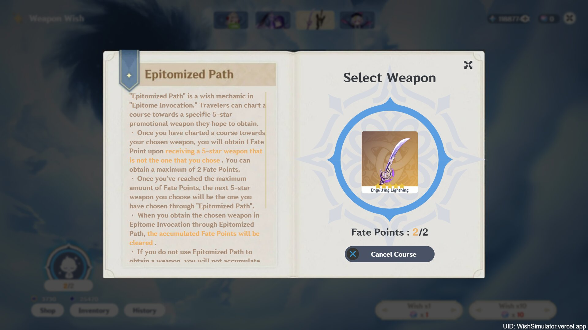
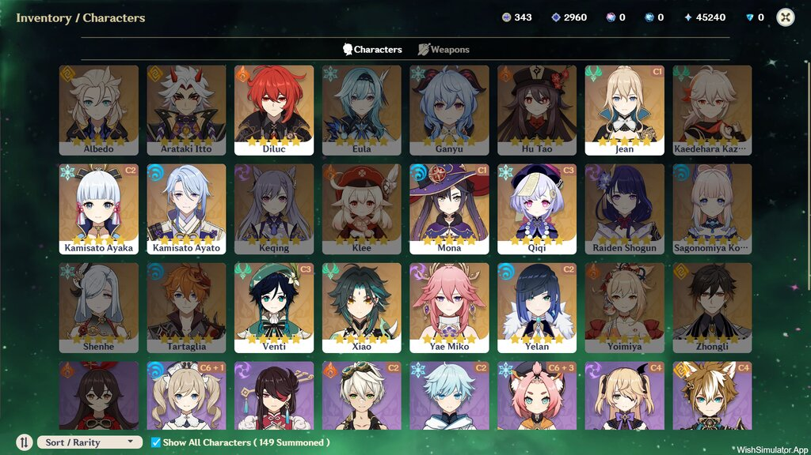
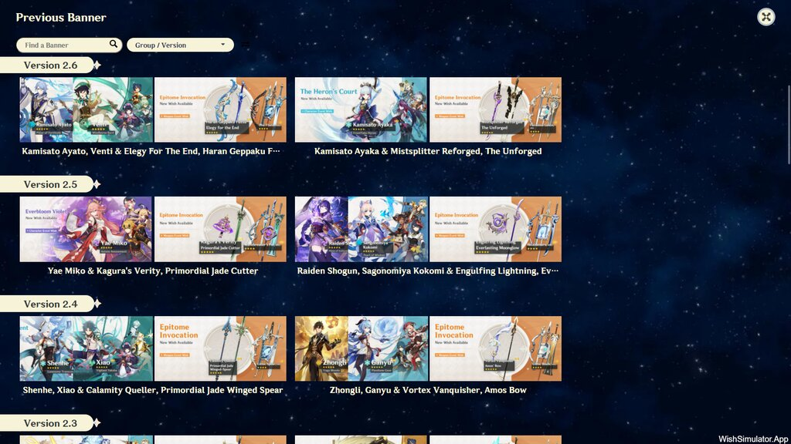
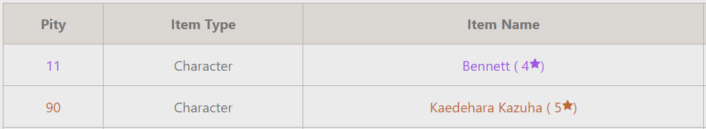

# Realistic Genshin Impact Wish Simulator

  [](https://www.codefactor.io/repository/github/Mantan21/genshin-impact-wish-simulator)   [](https://saweria.co/AguzzTN54)

I'm not an expert, and I may not write the cleanest code, but I've tried to create this Genshin Impact Wish Simulator. I believe it's the most realistic one for the web version. However, I still need your feedback to improve the wishing experience. If you enjoy this simulator, please consider giving a star to this repository.

## Screenshots

#### Main Banner



#### Layout on Mobile Version



#### Epitomized Path



#### Inventory



#### Switch banner



#### Shop


> For more preview, please visit the live version at [https://wishsimulator.app](https://wishsimulator.app)

---

## Features

1. **All banner types are available** ( Beginner, Standard, Event and Weapon Banner )
2. Dual or Single Character Event Banner.
3. **Epitomized Path System** for Weapon Banner start from version 2.0 - latest.
4. **Custom Banner Maker**, Users can create their own banners and share them to other travelers over the internet
5. The Pity System is designed to mimic the mechanics of the real game closely.
6. **The most complete set of banners** among all existing simulators. Users can switch and engage in gacha on every banner, starting from version 1.0 to the latest.
7. The Gacha Milestone Bonus, Starglitter, and Stardust can be exchanged for Acquaint or Intertwined Fate at the Shop section.
8. **Shop** serves Gacha currencies, outfits, and Welkin.
9. Users can purchase outfits and the Blessing of the Welkin Moon.
10. Pity is shared with the previous banner, allowing users to continuously engage in gacha on different patches without resetting the pity counter.
11. **Wish Details** for each banner.
12. Different banner type has different **Gacha History**
13. **Inventory** to show all items ( Weapons, Characters and Outfits ) that already owned by gacha or purchasement
14. Screenshot and download wish result as Image localy.
15. Pity Counter, Users can track their current information and history of their pity
16. Site Localization: I hope this Wish Simulator can reach more people, even those who aren't English speakers.
17. Mobile Friendly, responsive layout both landscape and portrait orientation.
18. LLink generator is available if users want to share their gacha results on the internet.
19. All user data will be saved to local storage and indexedDB.

## Pity System

I don't know how HoyoVerse's algorithm is, so I tried to create mine as realistic as possible with the following points based on in-game wish details.

> In order to get the same experience with the game when doing gacha, I tried to use the following formula for determining the gacha rates according to the current pity
>
> `baseRate + ((CurrentPity - HardPity) * additionalRate)`
>
> To get the number of `additionalRate`, I calculated `100% - baseRate` and divide it by the difference between `HardPity` to `MaxPity`.
> [Check here](https://github.com/Mantan21/Genshin-Impact-Wish-Simulator/blob/master/src/lib/helpers/gacha/probabilities.js#L4-L19) to see how I implemented it as code

Based on the formula above, it can be concluded that the probability table is as follows:

1. Probability for 4★ item on Character Event Wish

   - 4★ item guaranteed at `10` roll and promoted 4★ item guaranteed at `20` roll.
   - Base rate to get 4★ item is `5.1%`, guaranteed to get 4★ item at pity `10`

   | **Pity** |  1   |  2   |  3   |  4   |  5   |  6   |  7   |  8   |   9    | ≥10  |
   | -------: | :--: | :--: | :--: | :--: | :--: | :--: | :--: | :--: | :----: | :--: |
   | **Rate** | 5.1% | 5.1% | 5.1% | 5.1% | 5.1% | 5.1% | 5.1% | 5.1% | 52.55% | 100% |

2. Probability for 4★ item on Weapon Event Wish

   - 4★ item guaranteed at `10` roll and promoted 4★ item guaranteed at `20` roll.
   - Base rate to get 4★ item is `6.6%`, guaranteed to get 4★ item at pity `10`

   | **Pity** |  1   |  2   |  3   |  4   |  5   |  6   |  7   |  8   |   9    | ≥10  |
   | -------: | :--: | :--: | :--: | :--: | :--: | :--: | :--: | :--: | :----: | :--: |
   | **Rate** | 6.6% | 6.6% | 6.6% | 6.6% | 6.6% | 6.6% | 6.6% | 6.6% | 53.30% | 100% |

3. Weapon Wish Probability

   - 5★ Item guaranteed at `80` roll and promoted 5★ item guaranteed at `160` roll.
   - Probability to get 5★ item is `0.7%`, the rate starts to increase at pity 63 and then guaranteed at pity `80`.

   | **Pity** | ≤62  |  63   |   64   |   65   |   66   |   67   |   68   |   69   |   70   |   71   |   72   |   73   |  74   |   75   |   76   |   77   |   78   |   79   | ≥80  |
   | -------: | :--: | :---: | :----: | :----: | :----: | :----: | :----: | :----: | :----: | :----: | :----: | :----: | :---: | :----: | :----: | :----: | :----: | :----: | :--: |
   | **Rate** | 0.7% | 6.21% | 11.77% | 17.25% | 22.76% | 28.28% | 33.80% | 39.31% | 44.83% | 50.35% | 55.86% | 61.38% | 66.9% | 72.41% | 77.93% | 83.45% | 88.96% | 94.48% | 100% |

4. Character Event and Standard Wish Probability

   - 5★ Item guaranteed at `90` roll and promoted 5★ item guaranteed at `180` roll.
   - Probability to get 5★ item is `0.6%`, the rate starts to increase at pity 74 and then guaranteed at pity `90`.

   | **Pity** | ≤73  |  74   |  75   |   76   |   77   |   78   |   79   |   80   |   81   |   82   |   83   |   84   |   85   |   86   |   87   |   88   |   89   | ≥90  |
   | -------: | :--: | :---: | :---: | :----: | :----: | :----: | :----: | :----: | :----: | :----: | :----: | :----: | :----: | :----: | :----: | :----: | :----: | :--: |
   | **Rate** | 0.6% | 6.45% | 12.3% | 18.14% | 23.99% | 29.83% | 35.68% | 41.53% | 47.38% | 53.22% | 59.07% | 64.92% | 70.76% | 76.61% | 82.46% | 88.30% | 94.15% | 100% |

5. When you guaranteed for *5 and *4 item at the same time, your next pull priority is *5 item and *4 item will appear next at pity 11. For example: On Character Event Banner, you doesn't get *5 item until pity 89 and your *4 pity is 9, So your next pull will looks like screenshot below.

   

## Development

This app build with [Svelte-Kit](https://kit.svelte.dev/) based on Javascript programming language.

Once you've cloned this project, install all dependencies with `npm install` (or `pnpm install` or `yarn`). Once all dependencies already installed, then you can start a development server or build for production:

```bash
npm run dev

# or start the server and open the app in a new browser tab
npm run dev -- --open
```

### How to Update new banner

- The guide to Add New Banner are moved to Wiki, [Read Here](https://github.com/Mantan21/Genshin-Impact-Wish-Simulator/wiki/How-to-Add-more-Banner)

## Building

Before creating a production version of your app, install an [adapter](https://kit.svelte.dev/docs/adapters) for your target environment, then run the command below. As default, this project use [Vercel Adapter](https://github.com/sveltejs/kit/tree/master/packages/adapter-vercel) and can be deployed to [Vercel.com](https://vercel.com)

```bash
npm run build
```

## Deployment

Before Deploy to online server, please setup the environment variables by renaming file `.env.example` to `.env` and change the variables if needed.

\*\* You can still deploy the app without even set the environment variables

---

## Contributing

I'm welcome to all contributors! Feel free to [open new Issue](https://github.com/Mantan21/Genshin-Impact-Wish-Simulator/issues/new) if you find any problem or just want to give any suggestions.

### Thank You to all Contributors

[](https://github.com/Mantan21/Genshin-Impact-Wish-Simulator/graphs/contributors)

> **Notes :**
>
> The data and assets used for this Project are taken from [Hoyo Wiki](https://wiki.hoyolab.com/), [Genshin Fandom Wiki](https://genshin-impact.fandom.com/wiki/Genshin_Impact_Wiki), [Honey Impact](https://genshin.honeyhunterworld.com/) and recorded from the game itself with several modification. <br/> **Important thing**: This App is not affiliated with Hoyoverse, all assets used for this application belongs to [Hoyoverse](http://hoyoverse.com/), so if you want to use assets from this repository, please credit them too.
